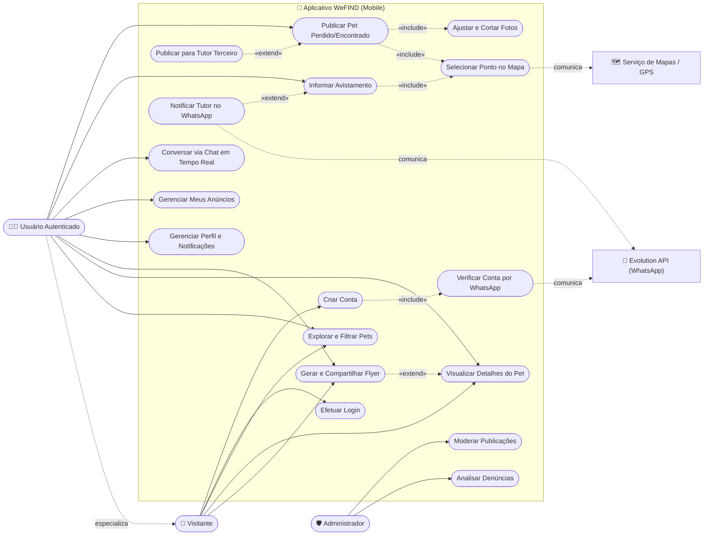
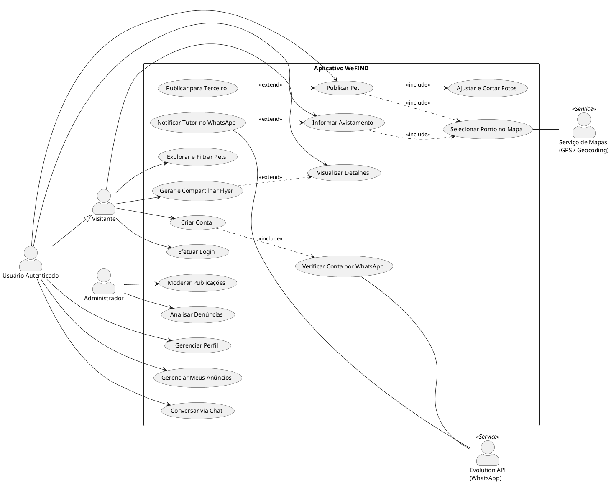

# 📊 Diagrama de Casos de Uso (UML) - WeFIND

Este documento contém a modelagem formal dos **Casos de Uso (UML Use Case Diagram)** do sistema **WeFIND**, projetada de acordo com as normas da ABNT/SBC para Trabalhos de Conclusão de Curso (TCC).

---

## 👥 1. Atores do Sistema

| Ator | Tipo | Descrição |
|---|---|---|
| 👤 **Visitante** | Humano (Primário) | Usuário não autenticado que acessa o app para buscar e visualizar pets perdidos/encontrados. |
| 🧑‍💼 **Usuário Autenticado (Tutor / Cidadão)** | Humano (Primário) | Usuário com conta verificada via WhatsApp que publica pets, informa avistamentos e conversa no chat. |
| 🛡️ **Administrador** | Humano (Secundário) | Responsável pela moderação de anúncios, análise de denúncias e métricas da plataforma. |
| 🤖 **Serviço WhatsApp (Evolution API)** | Sistema Externo | Gateway de mensageria para envio de códigos 2FA e alertas em tempo real. |
| 🗺️ **Serviço de Mapas (GPS / Geocoding)** | Sistema Externo | API de geolocalização, mapas interativos e geocodificação reversa de endereços. |

---

## 📐 2. Diagrama de Casos de Uso (Mermaid UML)

---

## 📋 3. Especificação Textual dos Principais Casos de Uso

### **1. Criar Conta com Verificação 2FA**
* **Ator Principal:** Visitante.
* **Atores Secundários:** Evolution API (WhatsApp).
* **Pré-condição:** O visitante não deve possuir conta com o e-mail ou WhatsApp informado.
* **Fluxo Principal:**
  1. O usuário preenche Nome, E-mail, WhatsApp (com DDD) e Senha.
  2. O usuário opta pelo consentimento de notificações no WhatsApp.
  3. O sistema gera um código de 6 dígitos e invoca a Evolution API (`«include» Verificar Conta por WhatsApp`).
  4. O usuário recebe a mensagem no WhatsApp e insere o código no modal.
  5. O sistema valida o token, cria a conta no Supabase Auth e redireciona para a tela inicial.
* **Pós-condição:** Usuário autenticado e perfil registrado no banco de dados.

---

### **2. Publicar Pet Perdido / Encontrado**
* **Ator Principal:** Usuário Autenticado.
* **Pré-condição:** Usuário deve estar logado.
* **Fluxo Principal:**
  1. O usuário seleciona o status (Perdido / Encontrado) e preenche espécie, raça, porte, cor, idade e coleira.
  2. O usuário seleciona até 6 fotos da galeria e utiliza a ferramenta de corte (`«include» Ajustar e Cortar Fotos`).
  3. O usuário abre o mapa interativo, posiciona o marcador no local exato do desaparecimento e confirma o endereço (`«include» Selecionar Ponto no Mapa`).
  4. *(Opcional)* O usuário ativa a publicação em nome de terceiros e informa o nome e WhatsApp do tutor responsável (`«extend» Publicar para Tutor Terceiro`).
  5. O usuário confirma a publicação e o pet fica visível no Feed Nacional.
* **Pós-condição:** Anúncio salvo e disponível para visualização e busca.

---

### **3. Informar Avistamento com Geolocalização**
* **Ator Principal:** Usuário Autenticado.
* **Atores Secundários:** Serviço de Mapas (GPS), Evolution API.
* **Pré-condição:** O pet deve estar com status "Perdido".
* **Fluxo Principal:**
  1. O usuário acessa a publicação do pet e clica em *"Informar Avistamento"*.
  2. O usuário descreve as condições em que o pet foi avistado.
  3. O usuário toca em *"Abrir mapa interativo"*, seleciona o ponto GPS e o endereço é preenchido via geocodificação reversa (`«include» Selecionar Ponto no Mapa`).
  4. *(Opcional)* O usuário anexa uma foto do pet no local e contatos para retorno.
  5. O usuário clica em *"Enviar Avistamento"*.
  6. O sistema salva o registro na tabela `sightings`.
  7. Se o tutor tiver notificações ativas, o sistema dispara uma notificação instantânea no WhatsApp do tutor contendo o link do Google Maps para traçar a rota até o local (`«extend» Notificar Tutor no WhatsApp`).
* **Pós-condição:** Avistamento publicado nos comentários e tutor alertado via WhatsApp.

---

### **4. Gerar e Compartilhar Flyer nas Redes Sociais**
* **Ator Principal:** Visitante ou Usuário Autenticado.
* **Pré-condição:** Existência de um anúncio de pet ativo.
* **Fluxo Principal:**
  1. O usuário clica no botão *"Compartilhar Cartaz / Flyer"*.
  2. O sistema renderiza em segundo plano o cartaz em alta resolução com faixa temática (Perdido/Encontrado), foto principal, dados, telefone do tutor e chave PIX/recompensa (se houver).
  3. É aberto o modal de pré-visualização.
  4. O usuário clica em *"Compartilhar Flyer"* e seleciona o WhatsApp, Instagram Stories, Facebook ou Telegram via API nativa de compartilhamento.
* **Pós-condição:** Imagem de alta fidelidade compartilhada externamente.

---

## 📄 4. Código Fonte PlantUML (Opcional para TCCs em LaTeX / Word)

Caso o seu orientador ou modelo de TCC exija o formato **PlantUML**:

