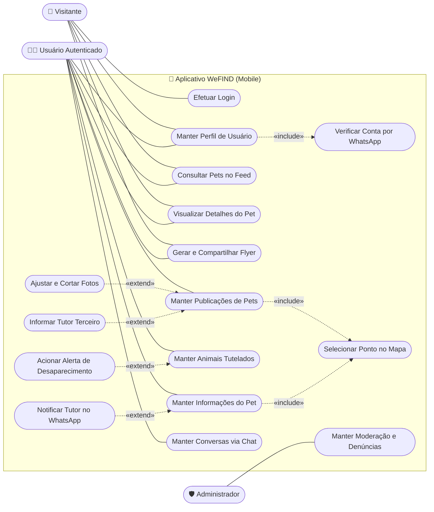
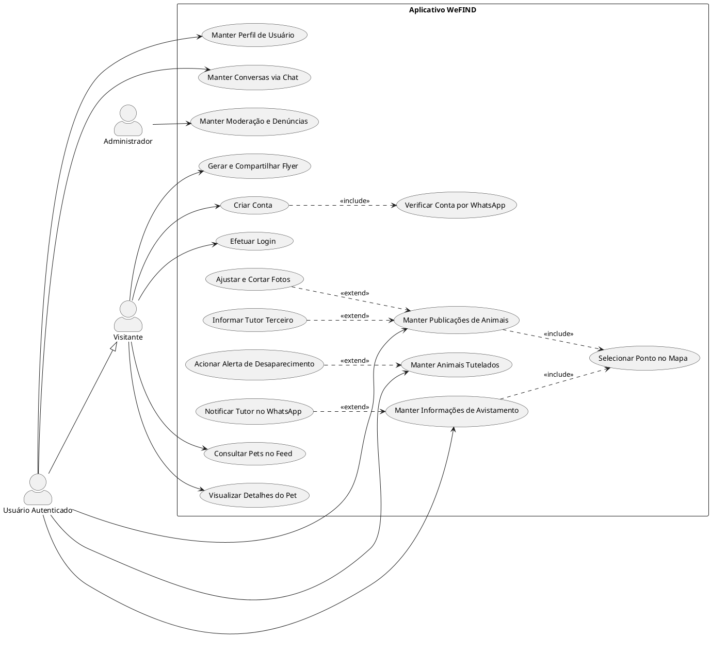

# 📊 Diagrama de Casos de Uso (UML) - WeFIND

Este documento contém a modelagem formal dos **Casos de Uso (UML Use Case Diagram)** do sistema **WeFIND**, projetada de acordo com as normas da ABNT/SBC para Trabalhos de Conclusão de Curso (TCC).

---

## 👥 1. Atores do Sistema

| Ator | Tipo | Descrição |
|---|---|---|
| 👤 **Visitante** | Humano (Primário) | Usuário não autenticado que acessa o app para buscar e visualizar pets perdidos/encontrados. |
| 🧑‍💼 **Usuário Autenticado (Tutor / Cidadão)** | Humano (Primário) | Usuário com conta verificada via WhatsApp que publica pets, compartilha informações e conversa no chat. |
| 🛡️ **Administrador** | Humano (Secundário) | Responsável pela moderação de anúncios, análise de denúncias e métricas da plataforma. |
| 🤖 **Serviço WhatsApp (Evolution API)** | Sistema Externo | Gateway de mensageria para envio de códigos 2FA e alertas em tempo real. |
| 🗺️ **Serviço de Mapas (GPS / Geocoding)** | Sistema Externo | API de geolocalização, mapas interativos e geocodificação reversa de endereços. |

---

## 📐 2. Diagrama de Casos de Uso (Mermaid UML)

---

## 📊 3. Tabela Completa de Casos de Uso do Sistema

Esta tabela consolida todos os casos de uso do WeFIND, seus respectivos atores primários/secundários, operações padronizadas (com a semântica de *Manter* para CRUDs) e relacionamentos de inclusão (`«include»`) e extensão (`«extend»`).

> **Regra de Generalização:** O ator **Usuário Autenticado** herda todas as permissões do ator **Visitante** (`Usuário Autenticado --|> Visitante`). Dessa forma, qualquer caso de uso acessível ao Visitante é automaticamente executável pelo Usuário Autenticado.

| Identificador | Caso de Uso (Elipse) | Ator Primário | Atores Secundários / Serviços | Descrição / Operações Padronizadas | Relacionamentos (`«include»`) | Relacionamentos (`«extend»`) |
|---|---|---|---|---|---|---|
| **UC01** | Efetuar Cadastro de Conta | Visitante | Evolution API (WhatsApp), Supabase Auth | Criação de nova conta de acesso mediante dados cadastrais e validação em duas etapas. | «include» UC02 (Verificar Conta por WhatsApp) | — |
| **UC02** | Verificar Conta por WhatsApp | Visitante / Usuário | Evolution API (WhatsApp) | Recepção e validação do token OTP de 6 dígitos enviado ao mensageiro. | — | — |
| **UC03** | Efetuar Autenticação (Login / Logout) | Visitante / Usuário | Supabase Auth | Autenticação por e-mail e senha, restauração de sessão persistente e encerramento. | — | — |
| **UC04** | Manter Perfil de Usuário | Usuário Autenticado | Supabase Storage, Evolution API | Cadastro, consulta, atualização de dados pessoais/contatos, foto de perfil, localização residencial e raio de busca. | «include» UC02 (caso altere o WhatsApp) | — |
| **UC05** | Consultar Ocorrências no Feed e Mapa | Visitante | GPS / Mapbox | Visualização espacial de animais perdidos, encontrados e para adoção com filtros combinados (espécie, raio em km, status). | — | — |
| **UC06** | Visualizar Detalhes do Animal | Visitante | GPS / Mapbox | Exibição de histórico, galeria de fotos, características morfológicas, mapa e dados do tutor. | — | — |
| **UC07** | Gerar e Compartilhar Cartaz (Flyer) | Visitante | API Nativa de Compartilhamento | Renderização de peça gráfica em alta resolução com dados da ocorrência e código QR inteligente para impressão ou redes. | — | — |
| **UC08** | Manter Publicações de Animais | Usuário Autenticado | Supabase Storage, GPS / Geocoding | CRUD completo de anúncios (cadastrar, consultar, editar, marcar como resolvido/reencontrado e excluir). | «include» UC12 (Selecionar Ponto no Mapa) | «extend» UC09 (Ajustar e Cortar Fotos), «extend» UC10 (Informar Tutor Terceiro) |
| **UC09** | Ajustar e Cortar Fotos | Usuário Autenticado | — | Ferramenta de enquadramento, recorte proporcional e compressão JPEG de até 6 fotografias antes do upload. | — | «extend» de UC08 |
| **UC10** | Informar Tutor Terceiro | Usuário Autenticado | Evolution API | Cadastro opcional de nome e WhatsApp de terceiro responsável pelo resgate/guarda do pet. | — | «extend» de UC08 |
| **UC11** | Manter Animais Tutelados | Usuário Autenticado | Supabase Storage, Gerador QR Code | Cadastro preventivo dos pets sob guarda do tutor, registro de vacinas, fotos e emissão de carteirinha digital com código QR de autenticidade. | — | «extend» UC11a (Acionar Alerta de Desaparecimento) |
| **UC11a**| Acionar Alerta de Desaparecimento | Usuário Autenticado | Notificações Push, Motor de Match | Conversão instantânea da ficha preventiva do animal tutelado em publicação ativa de perda no mapa, alertando a comunidade sem redigitação. | «extend» de UC11 | — |
| **UC12** | Selecionar Ponto no Mapa | Usuário Autenticado | GPS / Geocoding Reversa | Marcação precisa de coordenadas geográficas no mapa interativo com preenchimento automatizado de logradouro e bairro. | — | — |
| **UC13** | Manter Informações de Avistamento | Usuário Autenticado | GPS / Geocoding, Evolution API, Supabase Storage | Relato de pistas ou avistamento de pet perdido com foto do local, descrição e atualização da rota. | «include» UC12 (Selecionar Ponto no Mapa) | «extend» UC14 (Notificar Tutor no WhatsApp) |
| **UC14** | Notificar Tutor no WhatsApp | Usuário Autenticado | Evolution API | Disparo automatizado de mensagem instantânea ao tutor informando novo avistamento com link direto para navegação no Google Maps. | — | «extend» de UC13 |
| **UC15** | Manter Conversas via Chat Privativo | Usuário Autenticado | Supabase Realtime (WebSockets) | Envio e recepção de mensagens de texto e anexos fotográficos em canal seguro em tempo real, sem exposição de telefone. | — | — |
| **UC16** | Manter Moderação e Denúncias | Administrador | Painel de Moderação | Auditoria de publicações denunciadas pela comunidade, exclusão de postagens impróprias e suspensão de contas. | — | — |

---

## 📋 4. Especificação Textual dos Principais Casos de Uso

### **1. Criar Conta com Verificação 2FA**
* **Ator Principal:** Visitante.
* **Atores Secundários:** Evolution API (WhatsApp).
* **Pré-condição:** O visitante não deve possuir conta com o e-mail ou WhatsApp informado.
* **Fluxo Principal:**
  1. O usuário preenche Nome, E-mail, WhatsApp (com DDD) e Senha.
  2. O usuário opta pelo consentimento de notificações no WhatsApp.
  3. O sistema gera um código de 6 dígitos e invoca a Evolution API (`«include» Verificar Conta por WhatsApp`).
  4. O usuário recebe a mensagem no WhatsApp e insere o código no modal.
  5. O sistema valida o token, cria a conta no Supabase Auth e redireciona para a tela inicial.
* **Pós-condição:** Usuário autenticado e perfil registrado no banco de dados.

---

### **2. Publicar Pet Perdido / Encontrado**
* **Ator Principal:** Usuário Autenticado.
* **Pré-condição:** Usuário deve estar logado.
* **Fluxo Principal:**
  1. O usuário seleciona o status (Perdido / Encontrado) e preenche espécie, raça, porte, cor, idade e coleira.
  2. O usuário seleciona até 6 fotos da galeria e utiliza a ferramenta de corte (`«include» Ajustar e Cortar Fotos`).
  3. O usuário abre o mapa interativo, posiciona o marcador no local exato do desaparecimento e confirma o endereço (`«include» Selecionar Ponto no Mapa`).
  4. *(Opcional)* O usuário ativa a publicação em nome de terceiros e informa o nome e WhatsApp do tutor responsável (`«extend» Publicar para Tutor Terceiro`).
  5. O usuário confirma a publicação e o pet fica visível no Feed Nacional.
* **Pós-condição:** Anúncio salvo e disponível para visualização e busca.

---

### **3. Compartilhar Informações do Pet com Geolocalização**
* **Ator Principal:** Usuário Autenticado.
* **Atores Secundários:** Serviço de Mapas (GPS), Evolution API.
* **Pré-condição:** O pet deve estar com status "Perdido".
* **Fluxo Principal:**
  1. O usuário acessa a publicação do pet e clica em *"Compartilhar Informação"*.
  2. O usuário descreve detalhes, pistas e observações sobre onde o pet foi visto.
  3. O usuário toca em *"Abrir mapa interativo"*, seleciona o ponto GPS e o endereço é preenchido via geocodificação reversa (`«include» Selecionar Ponto no Mapa`).
  4. *(Opcional)* O usuário anexa uma foto do pet no local e contatos para retorno.
  5. O usuário clica em *"Enviar Informação"*.
  6. O sistema salva o registro na tabela `sightings`.
  7. Se o tutor tiver notificações ativas, o sistema dispara uma notificação instantânea no WhatsApp do tutor contendo o link do Google Maps para traçar a rota até o local (`«extend» Notificar Tutor no WhatsApp`).
* **Pós-condição:** Informações publicadas nos comentários e tutor alertado via WhatsApp.

---

### **4. Gerar e Compartilhar Flyer nas Redes Sociais**
* **Ator Principal:** Visitante ou Usuário Autenticado.
* **Pré-condição:** Existência de um anúncio de pet ativo.
* **Fluxo Principal:**
  1. O usuário clica no botão *"Compartilhar Cartaz / Flyer"*.
  2. O sistema renderiza em segundo plano o cartaz em alta resolução com faixa temática (Perdido/Encontrado), foto principal, dados, telefone do tutor e chave PIX/recompensa (se houver).
  3. É aberto o modal de pré-visualização.
  4. O usuário clica em *"Compartilhar Flyer"* e seleciona o WhatsApp, Instagram Stories, Facebook ou Telegram via API nativa de compartilhamento.
* **Pós-condição:** Imagem de alta fidelidade compartilhada externamente.

---

## 📄 5. Código Fonte PlantUML (Opcional para TCCs em LaTeX / Word)

Caso o seu orientador ou modelo de TCC exija o formato **PlantUML**:

