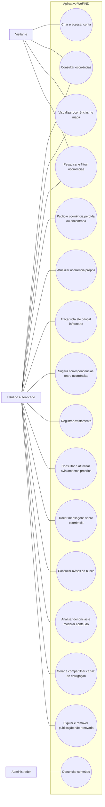

# Diagrama de casos de uso — escopo funcional central

O diagrama resume os requisitos funcionais centrais do Capítulo 4. Operações correlatas são agrupadas em casos de uso para manter a visão legível; recursos complementares implementados não são representados nesta figura.
