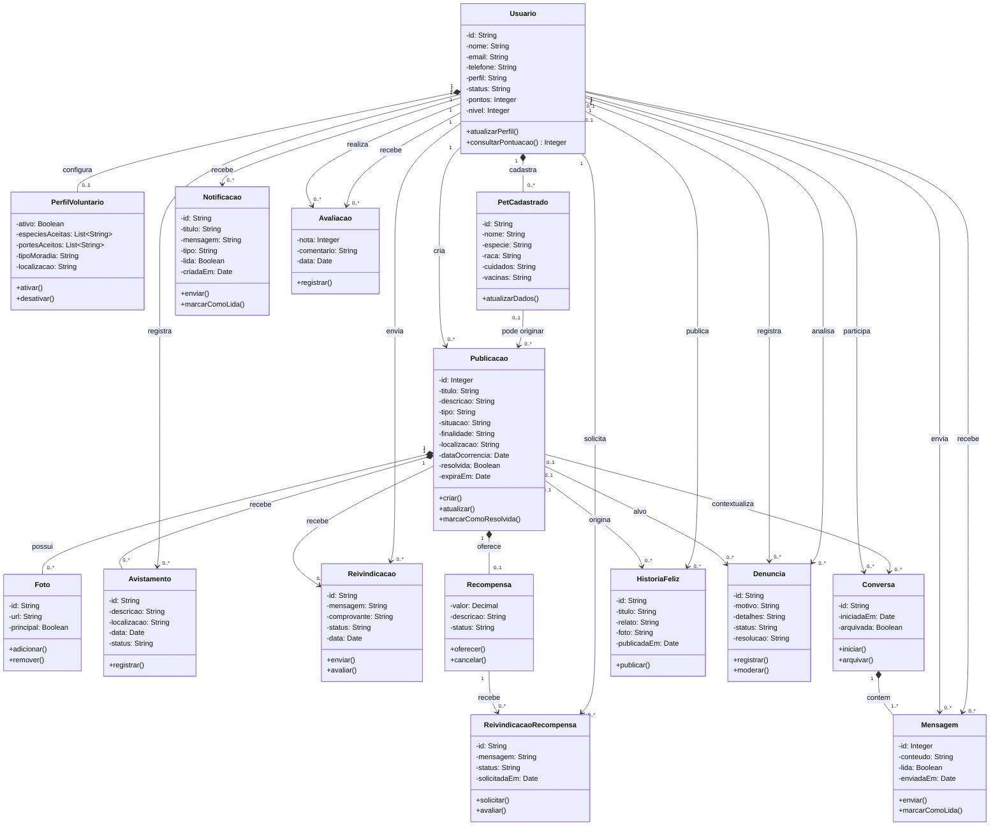

# Diagrama de Classes Conceitual — WeFIND

Este diagrama representa o **modelo conceitual de domínio** do WeFIND, uma
plataforma comunitária para localização e recuperação de animais perdidos ou
encontrados. Ele foi separado do modelo técnico para que possa ser utilizado
diretamente na documentação do TCC.

Os atributos usam visibilidade privada (`-`) e operações usam visibilidade
pública (`+`). Os tipos foram explicitados para facilitar a leitura acadêmica:
`String`, `Integer`, `Boolean`, `Date`, `Decimal` e `List<String>`. Os métodos
sem retorno explícito não exibem o tipo `void`.

## Diagrama

O código-fonte está em
[`DIAGRAMA_CLASSES_CONCEITUAL.puml`](./DIAGRAMA_CLASSES_CONCEITUAL.puml) e pode
ser renderizado no PlantUML, no Visual Studio Code ou importado no Astah e no
Lucidchart.

A versão Mermaid completa, com visibilidade, tipos, métodos e namespaces, está
disponível em [`DIAGRAMA_CLASSES_CONCEITUAL.mmd`](./DIAGRAMA_CLASSES_CONCEITUAL.mmd).

Para a seção de modelagem conceitual do TCC, recomenda-se a versão resumida,
disponível em [`DIAGRAMA_CLASSES_CONCEITUAL_RESUMIDO.mmd`](./DIAGRAMA_CLASSES_CONCEITUAL_RESUMIDO.mmd).
Ela apresenta somente os conceitos essenciais do domínio, sem métodos, serviços
ou detalhes específicos de implementação. Os atributos são apresentados apenas
pelos seus nomes, e as relações exibem as cardinalidades relevantes do negócio.

## Interpretação para o TCC

### O que caracteriza o modelo conceitual

No modelo conceitual, as classes representam conceitos reconhecidos pelos
usuários e pelas regras do negócio. Por isso, são priorizados `Usuario`,
`Pet`, `Publicacao`, `Avistamento`, `Reivindicacao`, `Conversa` e as demais
entidades diretamente relacionadas ao funcionamento da plataforma. Métodos,
tipos de retorno, classes de serviço, APIs e tabelas do banco pertencem a
modelos mais detalhados, como o diagrama lógico ou de implementação.

Na versão resumida, os atributos são mantidos somente quando ajudam a
identificar o conceito, sem visibilidade ou tipos. Como o diagrama conceitual
não detalha operações, também não são representados métodos públicos (`+`).
Essa escolha mantém o modelo focado no domínio e evita confundi-lo com um
modelo lógico ou de implementação.

- **Usuario** é o participante autenticado que publica, registra
  avistamentos, troca mensagens e interage com a comunidade.
- **Publicacao** é a entidade central: representa um animal perdido ou
  encontrado e concentra fotos, avistamentos, reivindicações e recompensa.
- **PerfilVoluntario** registra a disponibilidade de uma pessoa para oferecer
  lar temporário.
- **Mensagem** possui dois papéis de associação com `Usuario`: remetente e
  destinatário. A publicação é opcional e fornece o contexto da conversa.
- **HistoriaFeliz** representa o relato público de um reencontro bem-sucedido.
- **Denuncia** permite que uma publicação seja encaminhada para análise de
  moderação.

As cardinalidades expressam as regras principais do domínio. Por exemplo, um
usuário pode criar várias publicações (`1 : 0..*`), uma publicação pode possuir
até uma recompensa (`1 : 0..1`) e uma publicação pode receber vários
avistamentos (`1 : 0..*`).

## Observação metodológica

Este é um diagrama **conceitual**, portanto não reproduz todas as colunas do
Supabase nem os serviços da aplicação. Classes técnicas como autenticação,
armazenamento, notificações push e integração com WhatsApp são mecanismos de
implementação e podem ser apresentados separadamente no diagrama de
arquitetura.
