# 📊 Diagrama de Classes (UML) - WeFIND

Este documento contém a modelagem formal do **Diagrama de Classes (UML Class Diagram)** do sistema **WeFIND**, projetada de acordo com as normas da ABNT/SBC para Trabalhos de Conclusão de Curso (TCC).

O modelo reflete rigorosamente a arquitetura do ecossistema WeFIND (Mobile React Native + Supabase PostgreSQL + Edge Functions + Evolution API WhatsApp).

---

## 🧭 1. Visão Geral da Modelagem

O diagrama de classes está estruturado em **3 camadas lógicas**:

1. **Camada de Domínio / Entidades de Negócio (Entities / Models)**: Representa os dados e regras de negócio essenciais do sistema (Usuários, Pets/Itens, Fotos, Avistamentos, Mensagens, Recompensas, Denúncias, Lar Temporário).
2. **Camada de Enumerações e Tipos de Dados (Enums)**: Tipagem controlada para status, categorias, portes e modalidades de moradia.
3. **Camada de Serviços / Controladores (Services & External Gateways)**: Módulos de lógica operacional e integração com serviços externos (WhatsApp Evolution API, Supabase Storage, GPS/Geocodificação).

---

## 📐 2. Diagrama de Classes UML (Mermaid)

```mermaid
classDiagram
    %% ==========================================
    %% ENUMERAÇÕES
    %% ==========================================
    class ItemCategory {
        <<enumeration>>
        PET
        OBJETO
    }

    class ItemStatus {
        <<enumeration>>
        PERDIDO
        ENCONTRADO
    }

    class AnimalSize {
        <<enumeration>>
        PEQUENO
        MEDIO
        GRANDE
    }

    class SightingStatus {
        <<enumeration>>
        PENDENTE
        CONFIRMADO
        DESCARTADO
    }

    class ClaimStatus {
        <<enumeration>>
        PENDING
        APPROVED
        REJECTED
    }

    class ReportStatus {
        <<enumeration>>
        PENDING
        RESOLVED
    }

    class HousingType {
        <<enumeration>>
        HOUSE_YARD
        APARTMENT_NET
        HOUSE_NO_YARD
        FARM
    }

    %% ==========================================
    %% ENTIDADES DE DOMÍNIO
    %% ==========================================
    class Profile {
        -String id
        -String email
        -String name
        -String whatsapp
        -String phone
        -String avatarUrl
        -String avatarPath
        -Boolean adm
        -Boolean isFosterVolunteer
        -Boolean isBanned
        -DateTime createdAt
        -DateTime updatedAt
        +atualizarPerfil(dados: ProfileData) void
        +alterarFotoPerfil(fotoUri: String) String
        +solicitarExclusaoConta() Boolean
        +toggleVoluntarioLar(ativo: Boolean) void
    }

    class SignupVerification {
        -String id
        -String email
        -String whatsapp
        -String code
        -DateTime expiresAt
        -Integer attempts
        +gerarCodigo() String
        +validarCodigo(codigo: String) Boolean
        +expirar() void
    }

    class Item {
        -Integer id
        -String ownerId
        -String title
        -String description
        -ItemCategory category
        -String itemType
        -ItemStatus status
        -String state
        -String city
        -String neighborhood
        -Double latitude
        -Double longitude
        -Date date
        -String species
        -String breed
        -AnimalSize size
        -String age
        -Boolean collar
        -String animalName
        -String brand
        -String color
        -String serialNumber
        -JSON extraFields
        -Boolean resolved
        -DateTime expiresAt
        -DateTime createdAt
        +publicar() void
        +atualizar(dados: ItemData) void
        +marcarComoResolvido() void
        +renovarPublicacao(dias: Integer) void
        +excluir() void
        +estaExpirado() Boolean
    }

    class ItemPhoto {
        -String id
        -Integer itemId
        -String url
        -Boolean isCover
        -DateTime createdAt
        +uploadStorage(uri: String) String
        +excluirFoto() void
    }

    class Sighting {
        -String id
        -Integer itemId
        -String userId
        -String description
        -Double latitude
        -Double longitude
        -String address
        -String photoUrl
        -String contactName
        -String contactPhone
        -SightingStatus status
        -DateTime createdAt
        +registrarPista() void
        +anexarFoto(uri: String) void
        +obterRotaGPS() String
        +excluir() void
    }

    class Message {
        -Integer id
        -String senderId
        -String receiverId
        -Integer itemId
        -String content
        -String photoUrl
        -Boolean read
        -DateTime sentAt
        +enviar() void
        +marcarComoLida() void
        +ocultarConversa(userId: String) void
    }

    class Reward {
        -String id
        -Integer itemId
        -Decimal amount
        -String currency
        -String status
        -String description
        -String pixKey
        -DateTime createdAt
        +definirRecompensa(valor: Decimal, chavePix: String) void
        +reivindicar(reivindicacaoId: String) void
        +cancelar() void
    }

    class ItemClaim {
        -String id
        -Integer itemId
        -String claimantId
        -String message
        -String proofPhotoUrl
        -ClaimStatus status
        -DateTime createdAt
        +submeterReivindicacao(dados: ClaimData) void
        +avaliarReivindicacao(status: ClaimStatus) void
    }

    class FosterProfile {
        -String userId
        -Boolean isActive
        -List~String~ speciesAccepted
        -List~String~ sizesAccepted
        -HousingType housingType
        -Boolean hasOtherPets
        -String otherPetsInfo
        -String experienceNotes
        -String city
        -String state
        -String neighborhood
        -DateTime updatedAt
        +salvarConfiguracao() void
        +consultarDisponibilidade() Boolean
    }

    class Report {
        -String id
        -Integer itemId
        -String reporterId
        -String reason
        -String details
        -ReportStatus status
        -String resolution
        -String reviewedBy
        -DateTime createdAt
        -DateTime reviewedAt
        +criarDenuncia(motivo: String, detalhes: String) void
        +moderar(decisao: String, adminId: String) void
    }

    class UserRating {
        -String id
        -String targetUserId
        -String reviewerId
        -Integer rating
        -String comment
        -DateTime createdAt
        +avaliarUsuario(nota: Integer, comentario: String) void
        +calcularMedia(targetUserId: String) Double
    }

    class SuccessStory {
        -String id
        -Integer itemId
        -String userId
        -String title
        -String story
        -String photoUrl
        -DateTime createdAt
        +publicarHistoria() void
        +listarHistorias() List~SuccessStory~
    }

    class Notification {
        -String id
        -String userId
        -String title
        -String message
        -String type
        -JSON data
        -Boolean read
        -DateTime createdAt
        +dispararPush() void
        +dispararWhatsApp() void
        +marcarLida() void
    }

    %% ==========================================
    %% SERVIÇOS & CONTROLADORES
    %% ==========================================
    class AuthService {
        +login(email, password)
        +signUp(userData)
        +verifyWhatsAppCode(email, code)
        +resetPassword(email)
        +logout()
    }

    class ItemService {
        +registerItem(itemData, photos)
        +listItems(filters)
        +getItemDetails(id)
        +updateItem(id, itemData)
        +deleteItem(id)
        +renewItem(id)
    }

    class SightingService {
        +createSighting(sightingData, photo)
        +listSightingsByItem(itemId)
        +resolveReadableAddress(coords)
        +notifyOwnerViaWhatsApp(sighting)
    }

    class MessageService {
        +sendMessage(messageData)
        +getConversations(userId)
        +getMessagesByChat(userId, otherUserId, itemId)
        +markAsRead(messageIds)
    }

    class EvolutionApiService {
        +sendVerificationCode(phone, code)
        +sendSightingAlert(phone, petName, locationUrl, address)
        +checkInstanceStatus()
    }

    %% ==========================================
    %% RELACIONAMENTOS / ASSOCIAÇÕES
    %% ==========================================

    %% Profile e Item (1 Usuário publica N Itens)
    Profile "1" <-- "0..*" Item : publica

    %% Item e ItemPhoto (Composição: 1 Item possui N Fotos)
    Item "1" *-- "0..6" ItemPhoto : contem

    %% Item e Sighting (Composição: 1 Item recebe N Avistamentos)
    Item "1" *-- "0..*" Sighting : rastreado_por

    %% Profile e Sighting (1 Usuário registra N Avistamentos)
    Profile "1" <-- "0..*" Sighting : informa

    %% Item e Reward (Composição: 1 Item pode ter 1 Recompensa)
    Item "1" *-- "0..1" Reward : oferece

    %% Item e ItemClaim (1 Item pode receber N Reivindicações)
    Item "1" <-- "0..*" ItemClaim : reivindicado_em

    %% Profile e ItemClaim (1 Usuário submete N Reivindicações)
    Profile "1" <-- "0..*" ItemClaim : solicita

    %% Profile e FosterProfile (Composição/Agregação 1..1)
    Profile "1" *-- "0..1" FosterProfile : configura

    %% Profile e Message (Remetente e Destinatário)
    Profile "1" <-- "0..*" Message : envia
    Profile "1" <-- "0..*" Message : recebe
    Item "1" <-- "0..*" Message : referencia

    %% Item e Report (Denúncias sobre anúncios)
    Item "0..1" <-- "0..*" Report : alvo_de
    Profile "1" <-- "0..*" Report : denuncia
    Profile "0..1" <-- "0..*" Report : analisa

    %% Profile e UserRating
    Profile "1" <-- "0..*" UserRating : avaliado
    Profile "1" <-- "0..*" UserRating : avaliador

    %% Item / Profile e SuccessStory
    Item "1" <-- "0..1" SuccessStory : celebra
    Profile "1" <-- "0..*" SuccessStory : escreve

    %% Profile e Notification
    Profile "1" *-- "0..*" Notification : recebe

    %% Profile e SignupVerification
    Profile "0..1" ..> "1" SignupVerification : valida_com

    %% Serviços controlam entidades (Dependência)
    AuthService ..> Profile : gerencia
    AuthService ..> SignupVerification : valida
    AuthService ..> EvolutionApiService : requisita
    ItemService ..> Item : gerencia
    ItemService ..> ItemPhoto : gerencia
    SightingService ..> Sighting : gerencia
    SightingService ..> EvolutionApiService : dispara_alerta
    MessageService ..> Message : transmite
```

---

## 📋 3. Dicionário das Classes do Sistema

### 3.1. Entidades Principais

| Classe | Descrição de Negócio |
|---|---|
| **`Profile`** | Representa o perfil de usuário cadastrado no WeFIND, contendo dados de contato (WhatsApp validado), nível de privilégio (`adm`) e status de voluntário de Lar Temporário. |
| **`Item`** | Representa a publicação central do sistema: um animal de estimação ou objeto perdido/encontrado, suas características morfológicas, coordenadas GPS e status. |
| **`ItemPhoto`** | Imagem vinculada à publicação armazenada no Supabase Storage (`item-photos`), com suporte a até 6 fotos por anúncio. |
| **`Sighting`** | Informação ou pista de avistamento de um animal perdido em campo. Armazena a localização exata no mapa, foto opcional e aciona o alerta via WhatsApp. |
| **`Message`** | Mensagem de chat ponto a ponto entre usuários da plataforma vinculada ao contexto de um item ou negociação de devolução. |
| **`Reward`** | Recompensa financeira opcional associada ao anúncio de um pet perdido, contendo valor, chave PIX e controle de pagamento. |
| **`ItemClaim`** | Reivindicação formal de propriedade de um item/pet encontrado, permitindo envio de foto comprobatória e justificativa para o anunciante avaliar. |
| **`FosterProfile`** | Configuração do tutor como voluntário de Lar Temporário, detalhando porte aceito, tipo de moradia (casa murada, apartamento com tela) e presença de outros animais. |
| **`Report`** | Denúncia de conteúdo impróprio, fraude ou maus-tratos submetida para avaliação dos administradores na moderação. |
| **`UserRating`** | Avaliação por estrelas (1 a 5) e feedback sobre confiabilidade de usuários após negociações ou reencontros. |
| **`SuccessStory`** | Depoimento e registro fotográfico publicado no Mural de Reencontros quando um pet perdido é recuperado com sucesso. |
| **`Notification`** | Registro de notificações internas (in-app push) e rastreamento de disparos para a central do usuário. |
| **`SignupVerification`** | Armazena tokens temporários de 6 dígitos gerados para confirmação de WhatsApp no fluxo 2FA de cadastro. |

---

### 3.2. Serviços e Controladores (Camada de Aplicação)

| Classe de Serviço | Responsabilidade |
|---|---|
| **`AuthService`** | Gerenciamento de credenciais, criação de contas, login seguro, logout e verificação 2FA via WhatsApp. |
| **`ItemService`** | Processamento de cadastro de pets, geolocalização, controle de expiração (30 dias) e filtros de busca. |
| **`SightingService`** | Registro de avistamentos, geocodificação reversa de coordenadas para endereço e integração de alertas. |
| **`MessageService`** | Comunicação em tempo real via canais do Supabase Realtime e upload seguro de mídias de chat. |
| **`EvolutionApiService`** | Gateway cliente para envio de mensagens via API do WhatsApp (Evolution API). |

---

## 🔗 4. Justificativa dos Relacionamentos UML

1. **Composição (`Item` *-- `ItemPhoto`)**: A existência da foto depende estritamente do item publicado. Ao excluir um pet, todas as suas fotos no banco e no Storage são permanentemente excluídas.
2. **Composição (`Item` *-- `Sighting`)**: Os avistamentos pertencem ao ciclo de vida daquele pet perdido. Ao remover o anúncio, os avistamentos associados são eliminados em cascata.
3. **Composição (`Item` *-- `Reward`)**: A recompensa é uma extensão financeira direta do anúncio.
4. **Agregação / Composição (`Profile` *-- `FosterProfile`)**: O perfil de voluntário de Lar Temporário está diretamente atrelado à conta do usuário.
5. **Associações Simples (`Profile` <-- `Item`, `Profile` <-- `Message`)**: Um usuário pode ter vários itens e mensagens, mantendo ciclos de vida independentes.
6. **Dependência (`Service` ..> `Entity`)**: Os serviços manipulam as entidades de domínio sem possuí-las como propriedades internas estruturais.

---

## 📄 5. Código Fonte PlantUML (Para Astah, Lucidchart ou LaTeX)

Se o orientador ou o modelo de TCC da sua instituição solicitar o arquivo em **PlantUML**:

```plantuml
@startuml
skinparam classAttributeIconSize 0
skinparam shadowing false
skinparam roundcorner 8
skinparam class {
    BackgroundColor White
    ArrowColor #2C3E50
    BorderColor #2C3E50
}

enum ItemCategory {
  PET
  OBJETO
}

enum ItemStatus {
  PERDIDO
  ENCONTRADO
}

enum AnimalSize {
  PEQUENO
  MEDIO
  GRANDE
}

enum ClaimStatus {
  PENDING
  APPROVED
  REJECTED
}

enum ReportStatus {
  PENDING
  RESOLVED
}

class Profile {
  - id: String
  - email: String
  - name: String
  - whatsapp: String
  - phone: String
  - avatarUrl: String
  - adm: Boolean
  - isFosterVolunteer: Boolean
  - isBanned: Boolean
  - createdAt: DateTime
  + atualizarPerfil(dados: ProfileData): void
  + alterarFotoPerfil(fotoUri: String): String
  + toggleVoluntarioLar(ativo: Boolean): void
}

class SignupVerification {
  - id: String
  - email: String
  - whatsapp: String
  - code: String
  - expiresAt: DateTime
  + gerarCodigo(): String
  + validarCodigo(codigo: String): Boolean
}

class Item {
  - id: Integer
  - ownerId: String
  - title: String
  - description: String
  - category: ItemCategory
  - itemType: String
  - status: ItemStatus
  - state: String
  - city: String
  - neighborhood: String
  - latitude: Double
  - longitude: Double
  - species: String
  - breed: String
  - size: AnimalSize
  - age: String
  - collar: Boolean
  - animalName: String
  - resolved: Boolean
  - expiresAt: DateTime
  - createdAt: DateTime
  + publicar(): void
  + atualizar(dados: ItemData): void
  + marcarComoResolvido(): void
  + renovarPublicacao(dias: Integer): void
  + estaExpirado(): Boolean
}

class ItemPhoto {
  - id: String
  - itemId: Integer
  - url: String
  - isCover: Boolean
  + uploadStorage(uri: String): String
  + excluirFoto(): void
}

class Sighting {
  - id: String
  - itemId: Integer
  - userId: String
  - description: String
  - latitude: Double
  - longitude: Double
  - address: String
  - photoUrl: String
  - contactName: String
  - contactPhone: String
  - createdAt: DateTime
  + registrarPista(): void
  + anexarFoto(uri: String): void
  + obterRotaGPS(): String
}

class Message {
  - id: Integer
  - senderId: String
  - receiverId: String
  - itemId: Integer
  - content: String
  - photoUrl: String
  - read: Boolean
  - sentAt: DateTime
  + enviar(): void
  + marcarComoLida(): void
}

class Reward {
  - id: String
  - itemId: Integer
  - amount: Decimal
  - currency: String
  - status: String
  - description: String
  - pixKey: String
  + definirRecompensa(valor: Decimal, chavePix: String): void
  + cancelar(): void
}

class ItemClaim {
  - id: String
  - itemId: Integer
  - claimantId: String
  - message: String
  - proofPhotoUrl: String
  - status: ClaimStatus
  - createdAt: DateTime
  + submeterReivindicacao(dados: ClaimData): void
  + avaliarReivindicacao(status: ClaimStatus): void
}

class FosterProfile {
  - userId: String
  - isActive: Boolean
  - speciesAccepted: List<String>
  - sizesAccepted: List<String>
  - housingType: String
  - hasOtherPets: Boolean
  - city: String
  - state: String
  + salvarConfiguracao(): void
}

class Report {
  - id: String
  - itemId: Integer
  - reporterId: String
  - reason: String
  - details: String
  - status: ReportStatus
  - resolution: String
  - reviewedBy: String
  + criarDenuncia(motivo: String, detalhes: String): void
  + moderar(decisao: String, adminId: String): void
}

class UserRating {
  - id: String
  - targetUserId: String
  - reviewerId: String
  - rating: Integer
  - comment: String
  + avaliarUsuario(nota: Integer, comentario: String): void
  + calcularMedia(targetUserId: String): Double
}

class SuccessStory {
  - id: String
  - itemId: Integer
  - userId: String
  - title: String
  - story: String
  - photoUrl: String
  + publicarHistoria(): void
}

class Notification {
  - id: String
  - userId: String
  - title: String
  - message: String
  - read: Boolean
  + dispararPush(): void
  + dispararWhatsApp(): void
}

' Relacionamentos
Profile "1" <-- "0..*" Item : publica
Item "1" *-- "0..6" ItemPhoto : contem
Item "1" *-- "0..*" Sighting : rastreado_por
Profile "1" <-- "0..*" Sighting : informa
Item "1" *-- "0..1" Reward : oferece
Item "1" <-- "0..*" ItemClaim : reivindicado_em
Profile "1" <-- "0..*" ItemClaim : solicita
Profile "1" *-- "0..1" FosterProfile : configura
Profile "1" <-- "0..*" Message : envia
Profile "1" <-- "0..*" Message : recebe
Item "1" <-- "0..*" Message : referencia
Item "0..1" <-- "0..*" Report : alvo_de
Profile "1" <-- "0..*" Report : denuncia
Profile "0..1" <-- "0..*" Report : analisa
Profile "1" <-- "0..*" UserRating : avaliado
Profile "1" <-- "0..*" UserRating : avaliador
Item "1" <-- "0..1" SuccessStory : celebra
Profile "1" <-- "0..*" SuccessStory : escreve
Profile "1" *-- "0..*" Notification : recebe
Profile "0..1" ..> "1" SignupVerification : valida_com

@enduml
```

