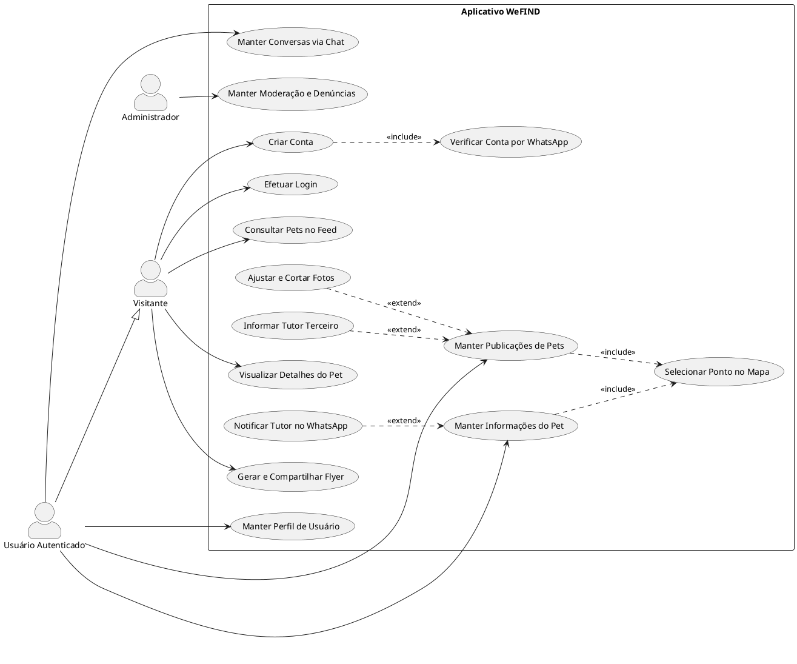

# 🎨 Prompt & Código para Lucidchart (Diagrama de Casos de Uso - WeFIND)

Use os recursos abaixo para gerar o Diagrama de Casos de Uso diretamente no **Lucidchart** (seja usando a IA do Lucidchart ou a ferramenta de importação nativa).

---

## 🤖 1. Prompt para a IA do Lucidchart (Lucid AI)

> Copie todo o texto abaixo e cole no campo de comando da **IA do Lucidchart** (botão *"Generate with AI"* / *"Gerar com IA"*):

```text
Crie um Diagrama de Casos de Uso UML formal e bem estruturado para o aplicativo mobile "WeFIND" (sistema de localização e recuperação de pets perdidos/encontrados).

Organize o diagrama com:
1. Atores Humanos:
   - "Visitante" (ator não autenticado)
   - "Usuário Autenticado" (especializa/herda de Visitante)
   - "Administrador" (responsável pela moderação)

2. Fronteira do Sistema: "Aplicativo WeFIND" contendo os seguintes casos de uso em elipses:
   - "Criar Conta"
   - "Verificar Conta por WhatsApp"
   - "Efetuar Login"
   - "Manter Perfil de Usuário"
   - "Consultar Pets no Feed"
   - "Visualizar Detalhes do Pet"
   - "Manter Publicações de Pets"
   - "Ajustar e Cortar Fotos"
   - "Informar Tutor Terceiro"
   - "Gerar e Compartilhar Flyer"
   - "Manter Informações do Pet"
   - "Selecionar Ponto no Mapa"
   - "Notificar Tutor no WhatsApp"
   - "Manter Conversas via Chat"
   - "Manter Moderação e Denúncias"

3. Relacionamentos e Associações:
   - Visitante conecta em: "Criar Conta", "Efetuar Login", "Consultar Pets no Feed", "Visualizar Detalhes do Pet", "Gerar e Compartilhar Flyer"
   - Usuário Autenticado conecta em: "Manter Publicações de Pets", "Manter Informações do Pet", "Manter Conversas via Chat", "Manter Perfil de Usuário"
   - Administrador conecta em: "Manter Moderação e Denúncias"

4. Relacionamentos de Inclusão (<<include>>):
   - "Criar Conta" tem <<include>> para "Verificar Conta por WhatsApp"
   - "Manter Publicações de Pets" tem <<include>> para "Selecionar Ponto no Mapa"
   - "Manter Informações do Pet" tem <<include>> para "Selecionar Ponto no Mapa"

5. Relacionamentos de Extensão (<<extend>>):
   - "Ajustar e Cortar Fotos" tem <<extend>> para "Manter Publicações de Pets"
   - "Informar Tutor Terceiro" tem <<extend>> para "Manter Publicações de Pets"
   - "Notificar Tutor no WhatsApp" tem <<extend>> para "Manter Informações do Pet"

Gere com visual limpo, atores bem posicionados e setas pontilhadas para <<include>> e <<extend>>.
```

---

## ⚡ 2. Importação Direta via PlantUML no Lucidchart

Caso prefira importar a estrutura exata sem depender da IA gerativa:

1. No Lucidchart, clique em **Arquivo (File) > Importar dados (Import Data)**.
2. Escolha **PlantUML**.
3. Cole o código abaixo e clique em **Importar**:



