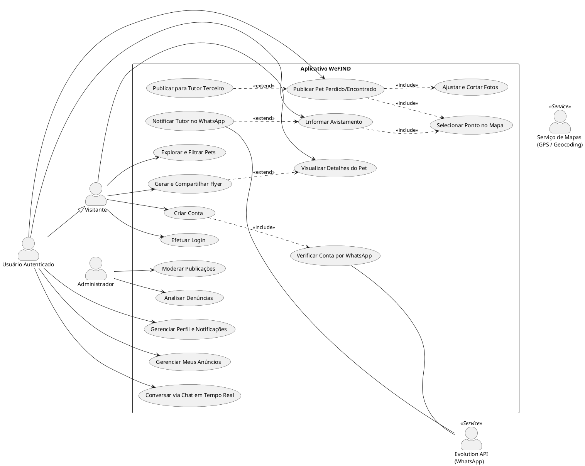

# 🎨 Prompt & Código para Lucidchart (Diagrama de Casos de Uso - WeFIND)

Use os recursos abaixo para gerar o Diagrama de Casos de Uso diretamente no **Lucidchart** (seja usando a IA do Lucidchart ou a ferramenta de importação nativa).

---

## 🤖 1. Prompt para a IA do Lucidchart (Lucid AI)

> Copie todo o texto abaixo e cole no campo de comando da **IA do Lucidchart** (botão *"Generate with AI"* / *"Gerar com IA"*):

```text
Crie um Diagrama de Casos de Uso UML formal e bem estruturado para o aplicativo mobile "WeFIND" (sistema de localização e recuperação de pets perdidos/encontrados).

Organize o diagrama com:
1. Atores Humanos (à esquerda e direita da fronteira):
   - "Visitante" (ator não autenticado)
   - "Usuário Autenticado" (especializa/herda de Visitante)
   - "Administrador" (responsável pela moderação)

2. Atores de Sistemas Externos:
   - "Evolution API (WhatsApp)" (serviço externo de mensageria 2FA e notificações)
   - "Serviço de Mapas e GPS" (serviço externo de geocodificação e rotas)

3. Fronteira do Sistema: "Aplicativo WeFIND" contendo os seguintes casos de uso em elipses:
   - Módulo Autenticação: "Criar Conta", "Verificar Conta por WhatsApp", "Efetuar Login", "Gerenciar Perfil e Notificações"
   - Módulo Pets: "Explorar e Filtrar Pets", "Visualizar Detalhes do Pet", "Publicar Pet Perdido/Encontrado", "Ajustar e Cortar Fotos", "Publicar para Tutor Terceiro", "Gerar e Compartilhar Flyer", "Gerenciar Meus Anúncios"
   - Módulo Interação: "Informar Avistamento", "Selecionar Ponto no Mapa", "Notificar Tutor no WhatsApp", "Conversar via Chat em Tempo Real"
   - Módulo Moderação: "Moderar Publicações", "Analisar Denúncias"

4. Relacionamentos e Associações:
   - Visitante conecta em: "Criar Conta", "Efetuar Login", "Explorar e Filtrar Pets", "Visualizar Detalhes do Pet", "Gerar e Compartilhar Flyer"
   - Usuário Autenticado conecta em: "Publicar Pet Perdido/Encontrado", "Informar Avistamento", "Conversar via Chat em Tempo Real", "Gerenciar Meus Anúncios", "Gerenciar Perfil e Notificações"
   - Administrador conecta em: "Moderar Publicações", "Analisar Denúncias"

5. Relacionamentos de Inclusão e Extensão:
   - "Criar Conta" tem <<include>> para "Verificar Conta por WhatsApp"
   - "Publicar Pet Perdido/Encontrado" tem <<include>> para "Ajustar e Cortar Fotos"
   - "Publicar Pet Perdido/Encontrado" tem <<include>> para "Selecionar Ponto no Mapa"
   - "Informar Avistamento" tem <<include>> para "Selecionar Ponto no Mapa"
   - "Publicar para Tutor Terceiro" tem <<extend>> para "Publicar Pet Perdido/Encontrado"
   - "Notificar Tutor no WhatsApp" tem <<extend>> para "Informar Avistamento"
   - "Gerar e Compartilhar Flyer" tem <<extend>> para "Visualizar Detalhes do Pet"

6. Integrações com Sistemas Externos:
   - "Verificar Conta por WhatsApp" comunica com "Evolution API (WhatsApp)"
   - "Notificar Tutor no WhatsApp" comunica com "Evolution API (WhatsApp)"
   - "Selecionar Ponto no Mapa" comunica com "Serviço de Mapas e GPS"

Gere com visual limpo, atores bem posicionados e setas pontilhadas para <<include>> e <<extend>>.
```

---

## ⚡ 2. Importação Direta via PlantUML no Lucidchart

Caso prefira importar a estrutura exata sem depender da IA gerativa:

1. No Lucidchart, clique em **Arquivo (File) > Importar dados (Import Data)**.
2. Escolha **PlantUML**.
3. Cole o código abaixo e clique em **Importar**:


